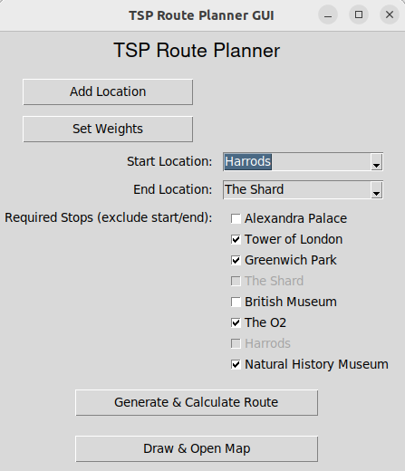

# TSP Solver Earth with OpenRouteService API

This project is designed to solve the Traveling Salesman Problem (TSP) for car routes using real road distances from the OpenRouteService API. It includes a GUI built with tkinter package for easy setup and configuration, scripts for fetching distances, a Python and C++ implementation for solving the TSP, and a map visualization of the route. The GUI is built on top of these scripts to simplify the process for users.



## Project Structure

The project is organized as follows:

- `cpp/`: Contains the C++ source code for the TSP algorithm.
- `temp/`: Stores temporary configuration, distance, and route output files generated during execution.
- `draw_route_on_map.py`: Script for visualizing the calculated TSP route on an interactive map.
- `find_route.py`: Main script for calculating the optimal TSP route.
- `generate_distances.py`: Fetches distances and durations between locations using the OpenRouteService API.
- `gui.py`: A graphical user interface for setting up locations, route preferences, and visualizing results.
- `api.key`: File to store the OpenRouteService API key (remember to never commit this to public repository with your actual API key).

## Setup and Usage

### Prerequisites

1. **API Key**: Obtain an API key from OpenRouteService and save it in a file named `api.key` in the main directory.
2. **Dependencies**:
   - Install required Python packages:
     ```bash
     pip install folium openrouteservice networkx pybind11 backoff
     ```
   - A C++ compiler with C++17 support is recommended if you wish to compile the TSP algorithm for better performance.

### Compilation (Optional)

Compiling the C++ module is optional but recommended for faster execution of `find_route.py`. To compile, run:

```bash
g++ -O3 -Wall -shared -std=c++2a -fPIC $(python3 -m pybind11 --includes) cpp/tps_solver.cpp -o cpp/tsp_solver$(python3-config --extension-suffix)
```

### Running the GUI

To start the GUI, simply run:

```bash
python3 gui.py
```

The GUI handles everything automatically, from setting up locations and route preferences to calculating the optimal route and visualizing it on a map. This makes it easy to use without needing to run each script separately.

The GUI allows you to:

- **Add locations** with coordinates.
- **Select start and end locations**.
- **Specify required stops** (excluding start and end).
- **Set distance and duration weights** for the TSP calculation.
- **Generate & calculate the optimal route**.
- **Visualize the route** on a map directly in your browser.

### Switching to the Command-Line Only Version

If you want to use the project without the GUI, switch to the `no-gui` branch, where detailed instructions on using each script individually are provided:

```bash
git checkout no-gui
```

This version includes more information about scripts usage and parameters, allowing you to run each part of the process manually.

### Troubleshooting `.so` Module Import

Example traceback: `Could not import the C++ module. Error: cannot import name 'tsp_solver' from 'cpp' (unknown location)`

If you encounter issues importing the `tsp_solver` module (the compiled C++ shared object file), ensure that the file is named exactly as follows:

```bash
tsp_solver.cpython-310-x86_64-linux-gnu.so
```

Copy and paste this exact name even if it appears your file already matches this, as character encoding sometimes cause issues. This specific filename applies only if your system architecture is `x86-64-linux-gnu`.

### Command Line Usage

Each script can also be run independently from the command line with help available through `-h`:

```bash
python3 generate_distances.py -h
python3 find_route.py -h
python3 draw_route_on_map.py -h
```

### Temporary Files

Temporary files (e.g., `config.yaml`, `distances.yaml`, `locations.yaml`, `route_output.yaml`, `map.html`) are saved in the `temp/` directory and ignored in version control.

## Dependencies

- **Python 3.x**
- **Folium**: For map visualization
- **OpenRouteService Python client**: To fetch route distances
- **NetworkX**: For graph operations in Python
- **pybind11**: For binding C++ and Python
- **C++ compiler** (with C++17 support): Optional, for improved performance
- **Backoff**: For retrying API calls

### Note on API Usage

The project relies on the OpenRouteService API, which has usage limits. Use it judiciously in order to avoid hitting rate limits.

## Example Workflow

1. **Add locations** and specify their coordinates in the GUI.
2. **Select start and end locations** and define any required stops.
3. **Generate and calculate the route** using the TSP solver.
4. **Visualize the calculated route** on an interactive map.
